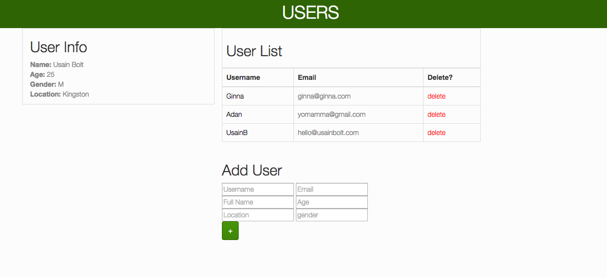

**Overview**

This is a simple fullstack app I made to test AJAX calls in Node.js. You can add and delete users in a Mongo collection or expand user profile, with results rendered asyncronously. 

**Technologies Used**

*Backend*
+ Node.js
+ Mongodb
+ Mongoskin

*Frontend*
+ SASS
+ Swig

**Get Started**

+ clone repo
+ install [Node.js](https://gist.github.com/isaacs/579814)
+ npm install
+ npm start

